## Day 1

Copied resume layout in Figma editor

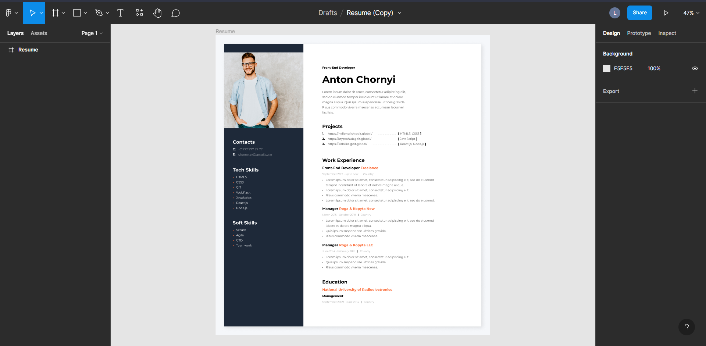

VSC editor with basic HTML structure

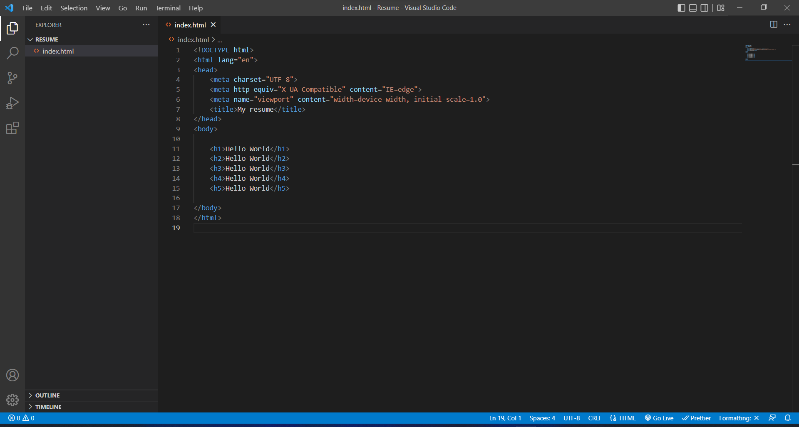

## Day 2

Soft Skills block

Third place of work block

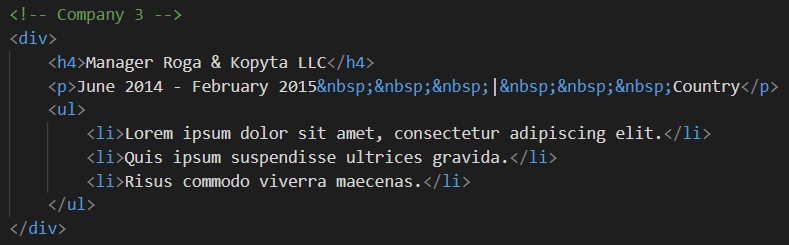

Education block

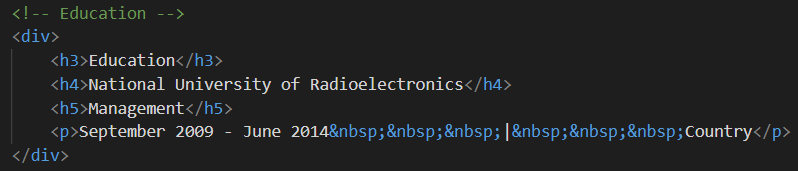

## Day 3

CSS styles and fonts connection

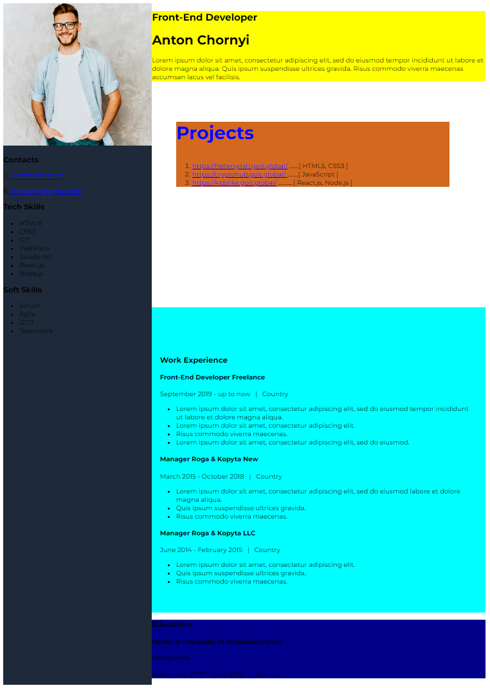

## Day 4

Sidebar

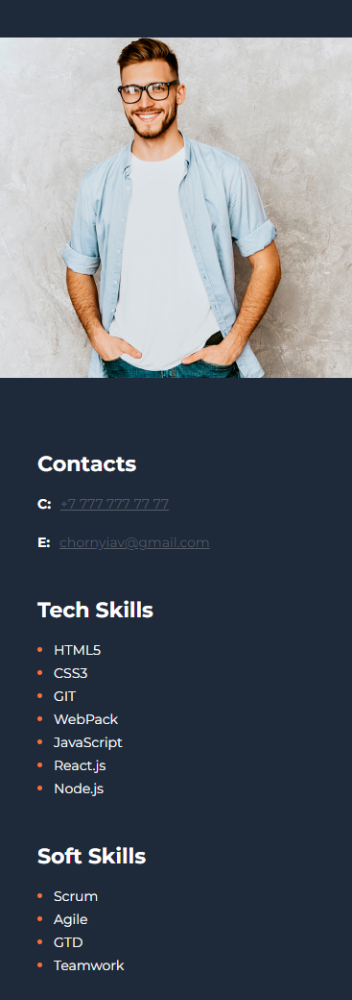

Soft Skills HTML source code

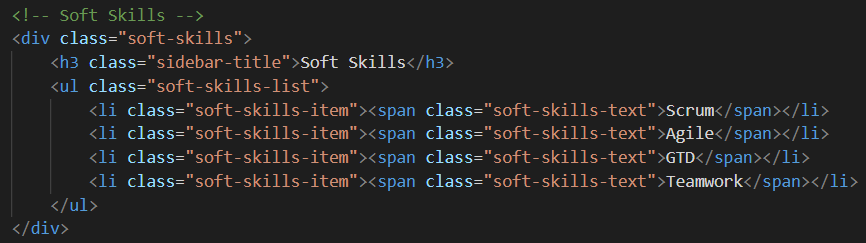

Soft Skills CSS source code

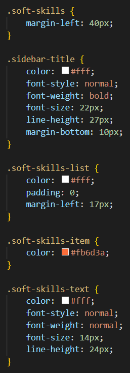

## Day 5

Working page

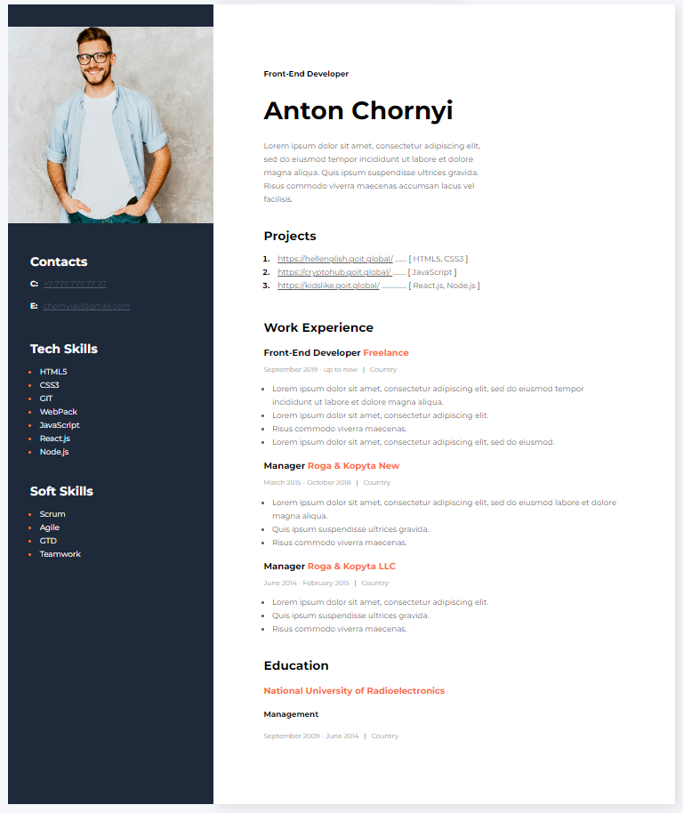

Third Company and Education HTML source code

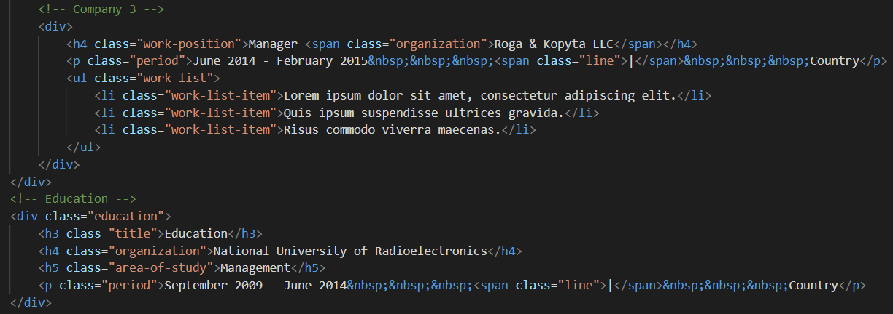

Third Company and Education CSS source code

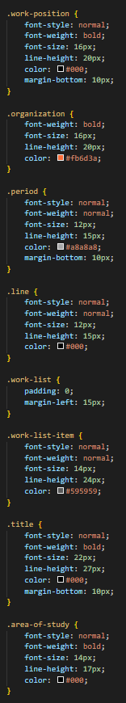

